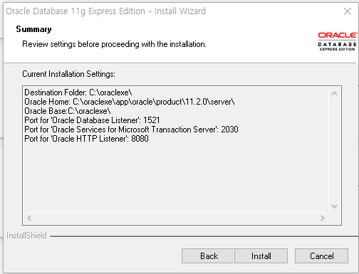

## Oracle 실습

### 1. Ora_Help.zip 압축 풀어서 C드라이브에 저장한다. <br>
- 오라클 수업 교재를 Ora_Help로 대신한다. <br>
- ora_help.exe는 관리자 권한으로 실행한다.
- 관리자 권한으로 실행하지 않으면 실행되지 않을 때도 있다.
### 2. C:\Class\WorkSpace 경로에 OracleClass 폴더 생성한다.
C:\Class\WorkSpace<br>
    └ OracleClass <br>
            └ days01 <br>

### 3. Oracle 11g XE(Express Edition ) 설치한다. 
https://www.oracle.com/database/technologies/xe-prior-release-downloads.html<br>

    Oracle Database 11g == grid (숫자는 버전)
    Oracle Database 21c == cloud
    Oracle Database  9i == internet

    오라클 종류(edition)
     : EE, SE, SEO, XE([ex]press):무료버전(1개밖에 설치 못한다.), PE(DB서버 혼자 쓰는 개인용)

### 4. Windows 64-bit with JDK 11 included 다운로드
https://www.oracle.com/database/sqldeveloper/technologies/download/

### 5. Oracle Database 11gR2 Express Edition for Windows x64 다운로드
https://www.oracle.com/database/technologies/xe-prior-release-downloads.html
```
- Getting Started:
		Oracle Database 11gR2 XE Documentation 설명서
		https://docs.oracle.com/cd/E17781_01/index.htm
	    - OracleXE112_Win64 압축 풀고 setpu.exe 파일 실행 -- > 비밀번호 
	    - SYS, SYSTEM DB관리자(DBA라고 한다)      DBA계정 비밀번호는 : ss123$
		DB서버가 사용하는 통로가 Port 번호 : 1521
		 : 2030
		웹 번호 : 8080
```

### 6. Oracle 설치
- OracleXE112_Win64.zip 압축해제 후 setup.exe 파일 실행
- SYS, SYSTEM DB관리자(DBA) 계정 + 비밀번호 [ ss123$ ]
- 오라클 설치화면을 저장한다.<br>
<br>

### 7. Oracle 11g XE 설치하고 난 후 확인 작업
1. C:\oraclexe 폴더 생성 되었는지 확인한다.<br>
2. 제어판 - 시스템 및 보안 - 관리도구 - 서비스<br>
	- Oracle 실행 안될 때 ? <br>
      서비스 -> OracleServiceXE가 시작이 되어 있는지 확인 후 시작 안되어 있으면 시작하기.<br>

1)OracleService + SID(시스템식별자) 유료는 이름을 부여해야하고, 기본은 orcl로 되어 있음. -- 무료는 XE가 기본<br>
	하나의 서버 안에 여러개의 오라클 서버를 설치 할 수 있음<br>
	설치 된 것중 하나를 찾으려고 할 때 각각 가지고 있는 고유한 이름을 찾으면 된다.  SID <br>
2)OracleXETNSListener 가 시작되어 있는지 확인해야 함. 시작 안되어 있으면 시작하기.<br>
	     	  OracleService + SID + TNSListener<br>

### 8.클라이언트 도구  다운로드 + 설치 
- 오라클서버에 연결해서 관리하는 클라이언트 도구가 필요하기 때문에 SQL Developer 23.1를 설치한다.<br>
- sqldeveloper-22.2.1.234.1810-x64 압축풀어서 C 드라이브에 복사 + 붙이기 <br>
     -> 바탕화면에 바로가기 - sqldeveloper-22.2.1.exe<br>

### 9.
- SID(시스템식별자)==XE
- 전역 데이터베이스 이름 ==XE
- OracleXETNSListener - 네트워크를 통해서 오라클을 사용하는 클라이언트가 오라클 서버와 연결을 담당하는 관리 프로그램이다.

### 10. Oracle 삭제 방법
1. 윈도우 서비스 실행 - 오라클과 관련된 서비스 모두 중지.<br>
2. 메뉴 - uninstall, deinstall 클릭해서 삭제. (무료 버전에는 메뉴에 버튼이 없음)<br>
	    프로그램 추가/삭제 -> oracle 제거하면 된다.<br>
3. 2번을 수행해도 C:\oraclexe에 설치 폴더는 남아 있기 때문에 폴더를 삭제한다.<br>
4. (무료버전은 해당없음) <br>
    레지스터리 삭제 해야 한다. -> 레지스터리 편집기 실행 -> LOCAL_MACHINE에서 4군데를 삭제한다.--- 검색해서 찾아보기<br>

### 11. 
클라이언트 도구(본인PC) ----연결---> 오라클서버(본인PC)

클라이언트 도구(본인PC) ----연결---> 오라클서버(팀장PC)

1. 1521 포트 방화벽 해제해야 한다. <br> 
->방화벽 상태 확인 클릭 -> 고급설정 클릭-> 인바운드(밖->안) 규칙 클릭 -> 새 규칙-> 포트 클릭-> 다음-> 특정 로컬 포트 1521 입력 후 다음 (여러개는 ,로 추가해서 입력 가능하다.) -> 연결 허용 다음-> 3개 전부 체크 다음-> 이름 오라클1521 입력 마침.

